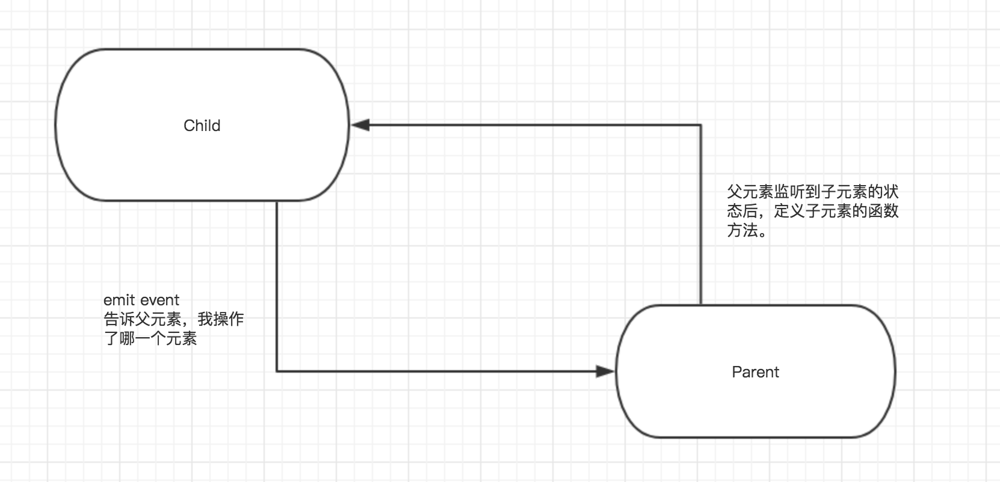

# 绑定自定义事件


> 🦊 $on负责定义自定义事件的方法，而$emit负责执行自定义事件。

1.$on 定义，$emit 执行:

*../components/chidren.vue*
``` html
<template>
    <div class="chidren"></div>
</template>

<script>
export default {
    created() {
    // 1⃣️ $on 定义事件方法
    this.$on('event', (e) => {
        console.log(e)
    })
    // 2⃣️ $emit 发(执)射(行)事件
    this.$emit('event', 'i am init when created')
    }
}
</script>

```

2.子组件执行事件，父组件定义事件

*../components/chidren.vue*
``` html
<template>
    <div class="chidren"></div>
</template>

<script>
export default {
    // 1⃣️ 在子组件的 created 周期中发(执)射(行) event 事件，
    // 再到父组件中定义事件的方法。
    created() {
        this.$emit(‘event', 'i am init when created')
    }
}
</script>
```

*./App.vue*

``` html
<template>
    <div id="app">
        <!--2⃣️ 在父组件中接收 event 自定义事件，并为其绑定一个函数方法，相当于用 $on 定义一个方法-->
        <chidren @event=“event"></chidren>
    </div>
</template>

<script>
import chidren from './components/chidren.vue'

export default {
    components: {
        chidren
    },
    methods: {
        // 3⃣️ 定义自定义事件的方法
        event(e) {
            console.log(e)
        }
    }
}
</script>
```

3.emit 事件命名

emit 出的事件名称一定要语义明确，并使用抽象的事件类型作为名称，如：
- click
- hover
- hoverExit
- keyboardFocus
- change

``` html
<mu-flat-button label="click me" 
                @hover="someEvent"></mu-flat-button>
```

4.native 事件

如果将发散出去的事件，加上 ``.native`` 修饰符，事件会执行当前作用域的事件，而不是发散出来的事件。

``` html
<mu-flat-button @click.native="someEvent" />
```