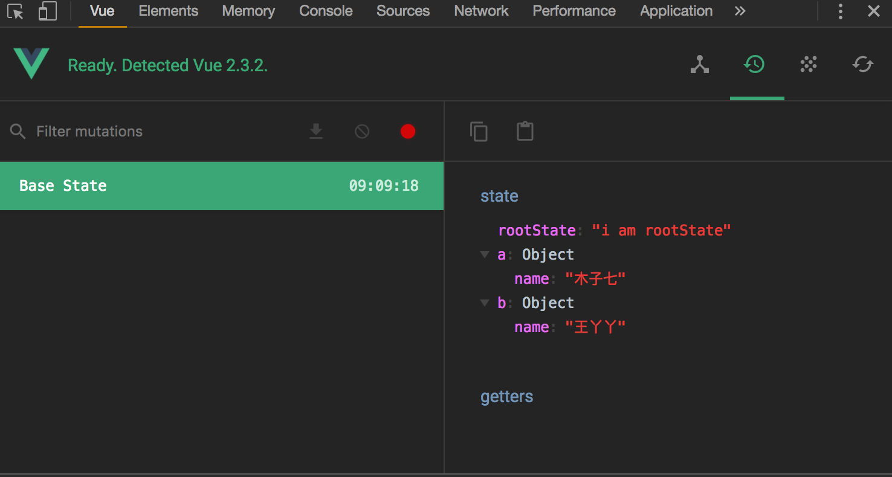

# Vuex modules 使用说明
## 索引
- [Modules - 基础使用](#modules)
- [Split - 拆分模块](#split)

### Modules
##### [返回索引](#索引)
**基础**
> 未拆分的情况下，使用 modules 属性

在 `./main.js` 中定义modules
``` javascript
import Vue from 'vue'
import Vuex from 'vuex'
import App from './App'

Vue.use(Vuex)

// defined modules
const ModuleA = {
    state: {
        name: '木子七'
    }
}
const ModuleB = {
    state: {
        name: '王丫丫'
    }
}

// use modules
const store = new Vuex.Store({
    modules: {
        a: ModuleA,
        b: ModuleB
    }
})

// init
new Vue({
  el: '#app',
  router,
  store,
  template: '<App/>',
  components: { App }
})
```
<br/>

如果一切运行正常，在 `vue-devtools` 中可以看到：



### 引用模版中的 `state` 状态数据有两种方式：
- 传统使用 computed 属性引用
``` javascript
export default {
    computed: {
        nameA () {
            return this.$store.state.a.name
        },
        nameB () {
            return this.$store.state.b.name
        }
    }
}
```

- 辅助函数 mapState 引用
``` javascript
import { mapState } from 'vuex'
export default {
    computed: {
        ...mapState({
            nameA (state) {
                return state.a.name
            },
            nameB (state) {
                return state.b.name
            }
        })
    }
}
```
### 其余属性 `mutations actions getters` 引用方式略微不同
> `mutations actions getters` 依靠命名来区分彼此\
以下使用一个简单 DEMO 来演示

<br/>

`./main.js`
``` javascript
import Vue from 'vue'
import Vuex from 'vuex'
import App from './App'

Vue.use(Vuex)

const ModuleA = {
  state: {
    count: 0
  },
  getters: {
    countFilterA (state, getters, rootState) {
      if (state.count > 5) {
        return state.count
      }
    }
  },
  mutations: {
    increaseA (state) {
      state.count ++
    }
  },
  actions: {
    // rootState 是根节点 store.state 的状态
    increaseAsyncA ({ state, commit, rootState }) {
      if ((state.count + rootState.count) % 2 === 1) {
        commit('increaseA')
      }
    }
  }
}

const ModuleB = {
  state: {
    count: 0
  },
  getters: {
    countFilterB (state, getters, rootState) {
      if (state.count > 5) {
        return state.count + rootState.count
      }
    }
  },
  mutations: {
    increaseB (state) {
      state.count ++
    }
  }
}

// 根节点
const store = new Vuex.Store({
  state: {
    count: 10
  },
  modules: {
    a: ModuleA,
    b: ModuleB
  }
})

// init
new Vue({
  el: '#app',
  store,
  template: '<App/>',
  components: { App }
})
```

`./App.vue`
``` html
<template>
    <div class="contianer">
        {{countFilterA}}
        {{countFilterB}}
        <p>module-a: <button @click="increaseA">{{countA}}</button></p>
        <p>module-b: <button @click="increaseB">{{countB}}</button></p>
        <button @click="increaseAsyncA">actions</button>
    </div>
</template>

<script>
import { mapState } from 'vuex'
import { mapGetters } from 'vuex'
import { mapMutations } from 'vuex'
import { mapActions } from 'vuex'

export default {
    computed: {
        // state
        ...mapState({
            countA (state) {
                return state.a.count
            },
            countB (state) {
                return state.b.count
            }
        }),
        // getters
        ...mapGetters([
            'countFilterA',
            'countFilterB'
        ])
    },
    methods: {
        // mutations
        ...mapMutations([
            'increaseA',
            'increaseB'
        ]),
        // actions
        ...mapActions([
            'increaseAsyncA'
        ])
    }
}
</script>
```

### split