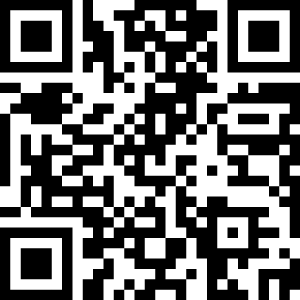

# canvas 实现刮刮卡（橡皮擦）功能
> 笔主最近一个多月以来 “深入“ 研究了 canvas 的实现原理，一口气读完了 《HTML5 Canvas 核心技术》这本书；而这一切以及这篇文章的诞生，都源于笔主公司的一位实习产品经理~  
> 这位实习生拥有刚毕业时的血气方刚，以及天马行空的想象力；他从未考虑过项目的实际需求，以及上线时间成本，在我们公司以注重产品功能为导向的氛围中，自成一派，成为一股清流 😂  
> 一个推广的小页面，需要有山有水，有天空有流星，手指放上去还得泛起涟漪，拿到需求文档时吓得我赶紧上 GG 搜 demo，这时我发现单个 demo 都能很好的运行在页面中，可是当他们合并以后，在浏览器调试面板中一行行鲜红的文字不停的拍打着我的脸颊。我突然发现自己在遇到一些奇葩需求时，是多么的无助。因为我不会 canvas 啊！  
> 本系列文章旨在与大家分享笔主这段时间学习 canvas 的经验，由浅入深，将自己实际工作过程中抄过的 demo （什么？做个抽奖？评估时间？你等等，我搜下 demo…… 哦，不用评估时间了，已经改好了）都一一实现一遍，让妈妈再也不用担心我们遇到奇葩需求啦！  

先上预览 [demo](https://musiky.github.io/canvas/eraser/)


> 我们假设我们的读者都非常熟悉 javascript 原生语法。  

### 本章涉及到的知识点

* **context 绘图环境**
我们可以通过 canvas 标签来新建一个 canvas 画布，这个 canvas 画布使得我们可以在浏览器中操作画布内的像素，来实现绘制图形，动画等功能；
想要操作 canvas 画布里的内容，只能使用 javascript，千万别尝试用 css3 的动画属性去操作它，没卵用~

我们想要操作 canvas，首先需要获取这个 canvas 对象

``` html
<canvas id="canvas" width="250" height="50"></canvas>
```

``` javascript
    // 获取 canvas 对象
let canvas = document.getElementById('canvas'),  
    // 获取 cavans 绘图环境对象，参数为 2d
	context = canvas.getContext('2d');
```

context 是绘图环境对象，如果你在浏览器中输出 context，你会发现里面包含了许多属性，如：`fillStyle` `strokeStyle`等，以及一些函数方法，`arc()` `rect()` `save()` `restore()` `clip()`等等。

<br/>

* **绘制基本图形**

#### 矩形

`context.rect($x, $y, $width, $height)`

> 矩形是最简单的图像绘制了；  

🔑 参数：
$x $y：分别对应矩形左上角在 canvas 画布中的坐标；
$width $height：就是矩形的宽高啦；

⚠️ 不过值得注意的是，调用这个方法，~只是绘制的矩形的路径~，该路径是不可见的，除非你在后面调用 `context.fill()` 和 `context.stroke()` 方法，进行填充或者描边。

填充描边的表现形式取决于 context 绘图环境的 `fillStyle`和`strokeStyle`属性的值。

#### 圆形  

`context.arc($x, $y, $radius, $start_radian, $end_radian [, $clockwise])`

> 圆形稍微复杂一丢丢，不过也很简单啦。  

🔑 参数：
$x $y：代表圆的圆心在 canvas 画布中的坐标点；
$radius：圆的半径，半径，是半径，不是直径！
$start_radian $end_radian：起始角和终止角，他们接收的值只能是弧度。

> 记得圆周率么？记得3.14是啥不，在 javascript 中 `Math.PI` 就代表的 π ；  
> 简单的说，圆有360°，而一个 π 是180°，你想画个整圆，就是从 0° 到 360° 走一圈，`Math.PI * 2`；你想画个半圆，就是 0° 到 180°，`Math.PI`；  

$clockwise：传入布尔值，false 圆由顺时针绘制；true 圆由逆时针绘制。

和矩形相同，这个方法也只是绘制了一个路径，想要在页面显示，任然是需要调用 `context.fill()` 和 `context.stroke()` 两个方法。

#### 当前路径  

`context.beginPath()`
我们在创建一个集合图形之前，都应当先调用该方法，该方法会清除上一次绘制时留下的路径，并将本次绘制的路径作为 ~当前路径~。

#### 绘制矩形和圆  

``` javascript
let canvas = document.getElementById('canvas'),
    context = canvas.getContext('2d');

/**
 * 绘制一个矩形
 * @param {Num} x      矩形的左上角 x 轴的位置
 * @param {Num} y      矩形的左上角 y 轴的位置
 * @param {Num} width  矩形的宽度
 * @param {Num} height 矩形的高度
 */
function drawRect(x, y, width, height) {
	context.beginPath();               // 清空上一次的路径
	context.rect(x, y, width, height); // 创建一个矩形路径
	context.fill();                    // 将该矩形路径填充为绘图环境指定的填充颜色 context.fillStyle
}

/**
 * 绘制一个圆形
 * @param {Num} centerX  圆心 x 轴坐标
 * @param {Num} centerY  圆心 y 轴坐标
 * @param {Num} radius   圆的半径
 */
function drawCircle(centerX, centerY, radius) {
    context.beginPath();
    context.arc(centerX, centerY, radius, 0, Math.PI * 2, false);
    context.fill();
}

drawRect(0, 0, 100, 100);
drawCircle(160, 50, 50);
```

<br/>

* **清除画布内容**
`context.clearRect($x, $y, $width, $height)`
该方法，擦除规定矩形中的所有内容；参数同绘制矩形是一样的，只不过这是清除！

<br/>

* **canvas 的状态**

canvas 的状态包括了：
1. 当前坐标变换信息，`transform` 的东西，不用担心，本章并不涉及；
2. 剪辑区域，这是本章的核心，`context.clip()` 后面会详细讲到；
3. 所有绘图环境（context）属性，也就刚刚提到的，`fillStyle[规定填充的颜色]` `strokeStyle[规定描边的颜色]`，这些状态决定的 canvas 中绘制的图像的展示效果，他们是全局的，也就是说一旦规定了`fillStyle`为红色，那么除非在 javascript 后面重置这个属性，否则你将来绘制出来的几何图形永远都是红色的。

``` javascript
context.fillStyle = 'red';
drawRect(0, 0, 100, 100);   // -> red
drawRect(110, 0, 100, 100); // -> red

context.fillStyle = 'blue';
drawRect(220, 0, 100, 100); // -> blue
```

<br/>

* **canvas 的状态保存与恢复**
前面已经提到过，canvas 的状态是什么。
而这里引出的是绘图环境中的两个很重要的方法，save() 和 restore()。

> 如果有个需求，我想要先绘制一个红色的矩形，接着绘制一个蓝色的矩形，最后再绘制一个红色的矩形  

我们知道 javascript 是逐条同步执行的，那么要实现上面的需求，我们需要先定义绘图环境的填充颜色为红色，绘制了第一个红色矩形后，再定义绘图环境的填充颜色为蓝色，绘制，再定义绘图环境的填充颜色为红色，就像这样：

``` javascript
context.fillStyle = 'red';
drawRect(0, 0, 100, 100);   // -> red

context.fillStyle = 'blue';
drawRect(110, 0, 100, 100); // -> blue

context.fillStyle = 'red';
drawRect(220, 0, 100, 100); // -> red
```

*是不是觉得这样做非常的傻~*

此时 save() 和 restore() 就站出来说不了！

`context.save()`：能将执行该方法之前的所有 ~canvas 状态~ 保存下来；
`context.restore()` ：将 save 方法保存的 ~canvas 状态~ 释放出来；

所以上面弱智的写法，我们可以写成这样：

``` javascript
context.fillStyle = 'red';
drawRect(0, 0, 100, 100);    // - red 

context.save();

context.fillStyle = 'blue';
drawRect(110, 0, 100, 100);  // -> blue

context.restore();
drawRect(220, 0, 100, 100);  // -> red
```

save 方法保存的是 `context.fillStyle = 'red'` 这个状态，当设置这个状态为蓝色时，context 绘图环境的 fillStyle 属性变成了蓝色，当执行 restore 方法时，又被恢复成了红色。

<br/>

* **剪辑区域 clip()**

context 绘图环境对象提供了一个 `context.clip()` 剪辑区域方法，这也是本章实现橡皮擦功能的核心方法。

该方法会将 ~当前路径~ 作为一个剪辑区域，使该区域以外的图像不可见。

并且在剪辑区域中，所有填充，清除等操作不会影响剪辑区域以外的内容。

所以我们可以创建一个剪辑区域，在这个剪辑区域中执行清除操作，就可以擦除 canvas 画布中指定的内容。

``` javascript
drawRect(0, 0, 100, 100);

context.save();

// 创建一个圆形路径，并作为剪辑区域，擦除该区域中的所有内容
drawCircle(0, 0, 50);
context.clip();
context.clearRect(0, 0, canvas.width, canvas.height);

context.restore();

drawRect(110, 0, 100, 100);
```

<br/>

### 开始实现橡皮擦

> 本章需要用到的基础知识就讲到这里啦，如果大家还有疑问，可以查阅 w3school 上的 [canvas 文档](http://www.w3school.com.cn/tags/html_ref_canvas.asp)  

⚠️ 这个 demo 只能运行在手机上，浏览器需要打开手机模拟。

🚶 思路：
1. 定义一个公用绘制剪辑区域的方法 `drawEraser()` ，该方法会将当前的路径作为剪辑路径绘制，并::清除该路径内的所有内容::；
2. 手指按下时，触发 touchstart 事件，开启 dragging 状态，调用 `drawEraser()` 方法，绘制第一个剪辑区域；
3. 手指移动过程中，不断的调用 `drawEraser()` 方法，绘制剪辑区域，实现橡皮擦效果。

``` html
<!DOCTYPE html>
<html>

<head>
	<title>橡皮擦</title>
	<meta name="viewport" content="width=device-width, initial-scale=1, maximum-scale=1.0, user-scalable=no">
</head>

<body>

	<canvas id="canvas" width="300" height="300" style="background: #eee">
		Canvas not supported
	</canvas>

	<script>
		var canvas = document.getElementById('canvas'),
			context = canvas.getContext('2d'),

			ERASER_SIZE = 15,  // 橡皮擦的大小

			dragging = false;  // 是否处在拖动状态

		/**
		 * 转换坐标值
		 * 将鼠标点击或移动时获取的坐标值，减去 canvas 相对窗口的坐标值，就是在 canvas 画布中的坐标值
		 * @param {Obj} e 手指当前相对窗口的坐标位置
		 */
		function windowToCanvas(e) {
			let x = e.targetTouches[0].clientX,
				y = e.targetTouches[0].clientY,
				bbox = canvas.getBoundingClientRect();

			return {
				x: x - bbox.left,
				y: y - bbox.top
			}
		}

		/**
		 * 绘制剪辑区域，并清除该区域中的内容
		 * @param {Obj} loc 手指当前相对 canvas 画布中的坐标位置
		 */
		function drawEraser(loc) {
			context.save();
			context.beginPath();
			context.arc(loc.x, loc.y, ERASER_SIZE, 0, Math.PI * 2, false);
			context.clip();
			context.clearRect(0, 0, canvas.width, canvas.height);
			context.restore();
		}

		/**
		 * 页面加载时，绘制一个铺满 canvas 画布的矩形
		 * 该矩形用于被擦除
		 */
		window.onload = function (e) {
			context.save();
			context.fillStyle = '#666';
			context.beginPath();
			context.fillRect(0, 0, canvas.width, canvas.height);
			context.restore();
		}

		/**
		 * ① 手指按下时，开启 dragging 状态，并绘制剪辑区域
		 */
		canvas.addEventListener('touchstart', function (e) {
			var loc = windowToCanvas(e);
			dragging = true;
			drawEraser(loc);
		})

		/**
		 * ② 手指移动时，不断进行剪辑区域的绘制，以及路径更新，实现擦除的效果
		 */
		canvas.addEventListener('touchmove', function (e) {
			var loc;

			if (dragging) {
				loc = windowToCanvas(e);
				drawEraser(loc);
			}
		})

		/**
		 * ③ 手指离开，结束擦除过程
		 */
		canvas.addEventListener('touchend', function (e) {
			dragging = false;
		})
	</script>
</body>

</html>
```


### 结语
* 使用 canvas 实现橡皮擦功能是非常简单的。我们可以把橡皮擦的形状换成矩形，多边形，五角星等等；只需要改变绘制剪辑区域的路径就行了；

* 刮刮卡的功能，也完全是由橡皮擦功能实现的，我们可以把 canvas 的背景图片设置为开奖的内容，文字等，用一个数组将这些图片的路径包含进去，每次加载页面时，随机调用一个数组元素；

* 这期内容就讲到这里，下期带大家用 canvas 实现 大转盘抽奖，九宫格抽奖。3Q，阿里呀多。

